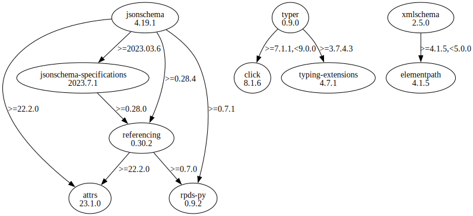

# Third Party Dependencies

<!--[[[fill sbom_sha256()]]]-->
The [SBOM in CycloneDX v1.4 JSON format](https://git.sr.ht/~sthagen/swid-lint/blob/default/etc/sbom/cdx.json) with SHA256 checksum ([68c706d8 ...](https://git.sr.ht/~sthagen/swid-lint/blob/default/etc/sbom/cdx.json.sha256 "sha256:68c706d83467e9df880f9311f0c0f6fe30fd6bb2ce3d3f74b41d1e4e10cfc742")).
<!--[[[end]]] (checksum: 78dfa955bb8002d06ed090ad8c7ea00f)-->
## Licenses

JSON files with complete license info of: [direct dependencies](direct-dependency-licenses.json) | [all dependencies](all-dependency-licenses.json)

### Direct Dependencies

<!--[[[fill direct_dependencies_table()]]]-->
| Name                                                          | Version                                               | License     | Author            | Description (from packaging data)                                  |
|:--------------------------------------------------------------|:------------------------------------------------------|:------------|:------------------|:-------------------------------------------------------------------|
| [jsonschema](https://github.com/python-jsonschema/jsonschema) | [4.20.0](https://pypi.org/project/jsonschema/4.20.0/) | MIT License | Julian Berman     | An implementation of JSON Schema validation for Python             |
| [typer](https://github.com/tiangolo/typer)                    | [0.9.0](https://pypi.org/project/typer/0.9.0/)        | MIT License | Sebastián Ramírez | Typer, build great CLIs. Easy to code. Based on Python type hints. |
| [xmlschema](https://github.com/sissaschool/xmlschema)         | [3.0.0](https://pypi.org/project/xmlschema/3.0.0/)    | MIT License | Davide Brunato    | An XML Schema validator and decoder                                |
<!--[[[end]]] (checksum: b1fb8a06e0a04a891692c24828dd709c)-->

### Indirect Dependencies

<!--[[[fill indirect_dependencies_table()]]]-->
| Name                                                                                        | Version                                                                  | License                            | Author                                                                                | Description (from packaging data)                                    |
|:--------------------------------------------------------------------------------------------|:-------------------------------------------------------------------------|:-----------------------------------|:--------------------------------------------------------------------------------------|:---------------------------------------------------------------------|
| [attrs](https://www.attrs.org/en/stable/changelog.html)                                     | [23.2.0](https://pypi.org/project/attrs/23.2.0/)                         | MIT License                        | Hynek Schlawack <hs@ox.cx>                                                            | Classes Without Boilerplate                                          |
| [click](https://palletsprojects.com/p/click/)                                               | [8.1.6](https://pypi.org/project/click/8.1.6/)                           | BSD License                        | Pallets <contact@palletsprojects.com>                                                 | Composable command line interface toolkit                            |
| [elementpath](https://github.com/sissaschool/elementpath)                                   | [4.1.5](https://pypi.org/project/elementpath/4.1.5/)                     | MIT License                        | Davide Brunato                                                                        | XPath 1.0/2.0/3.0/3.1 parsers and selectors for ElementTree and lxml |
| [jsonschema-specifications](https://github.com/python-jsonschema/jsonschema-specifications) | [2023.7.1](https://pypi.org/project/jsonschema-specifications/2023.7.1/) | MIT License                        | Julian Berman                                                                         | The JSON Schema meta-schemas and vocabularies, exposed as a Registry |
| [referencing](https://github.com/python-jsonschema/referencing)                             | [0.30.2](https://pypi.org/project/referencing/0.30.2/)                   | MIT License                        | Julian Berman                                                                         | JSON Referencing + Python                                            |
| [rpds-py](https://github.com/crate-py/rpds)                                                 | [0.9.2](https://pypi.org/project/rpds-py/0.9.2/)                         | MIT License                        | Julian Berman                                                                         | Python bindings to Rust's persistent data structures (rpds)          |
| [typing_extensions](https://github.com/python/typing_extensions)                            | [4.7.1](https://pypi.org/project/typing_extensions/4.7.1/)               | Python Software Foundation License | "Guido van Rossum, Jukka Lehtosalo, Łukasz Langa, Michael Lee" <levkivskyi@gmail.com> | Backported and Experimental Type Hints for Python 3.7+               |
<!--[[[end]]] (checksum: 75caac3380969b2fc38a9d1018de3d75)-->

## Dependency Tree(s)

JSON file with the complete package dependency tree info of: [the full dependency tree](package-dependency-tree.json)

### Rendered SVG

Base graphviz file in dot format: [Trees of the direct dependencies](package-dependency-tree.dot.txt)



### Console Representation

<!--[[[fill dependency_tree_console_text()]]]-->
````console
jsonschema==4.20.0
├── attrs [required: >=22.2.0, installed: 23.2.0]
├── jsonschema-specifications [required: >=2023.03.6, installed: 2023.7.1]
│   └── referencing [required: >=0.28.0, installed: 0.30.2]
│       ├── attrs [required: >=22.2.0, installed: 23.2.0]
│       └── rpds-py [required: >=0.7.0, installed: 0.9.2]
├── referencing [required: >=0.28.4, installed: 0.30.2]
│   ├── attrs [required: >=22.2.0, installed: 23.2.0]
│   └── rpds-py [required: >=0.7.0, installed: 0.9.2]
└── rpds-py [required: >=0.7.1, installed: 0.9.2]
typer==0.9.0
├── click [required: >=7.1.1,<9.0.0, installed: 8.1.6]
└── typing-extensions [required: >=3.7.4.3, installed: 4.7.1]
xmlschema==3.0.0
└── elementpath [required: >=4.1.5,<5.0.0, installed: 4.1.5]
````
<!--[[[end]]] (checksum: 1733e1504854c4ec3e85fb18ef66d4be)-->
